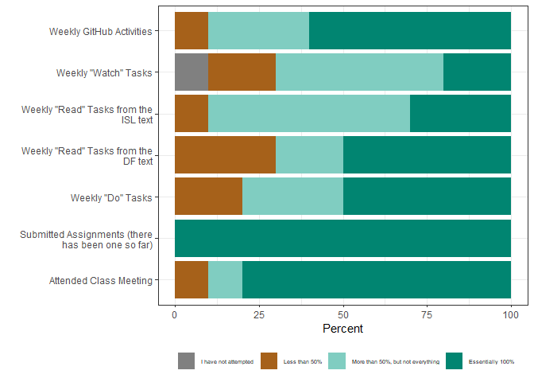
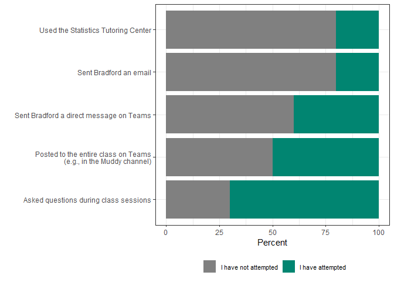
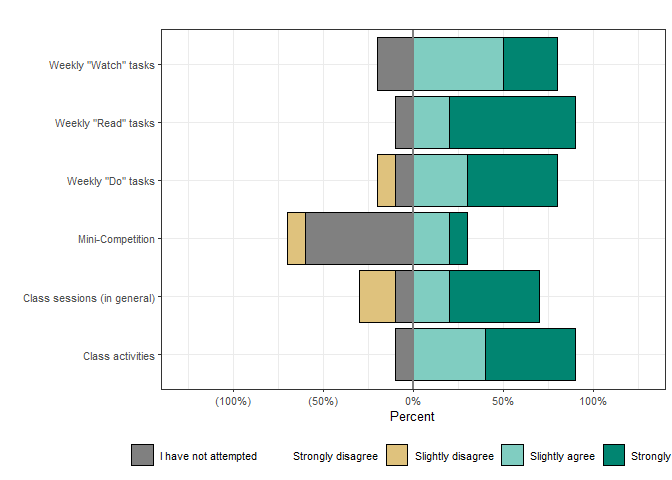
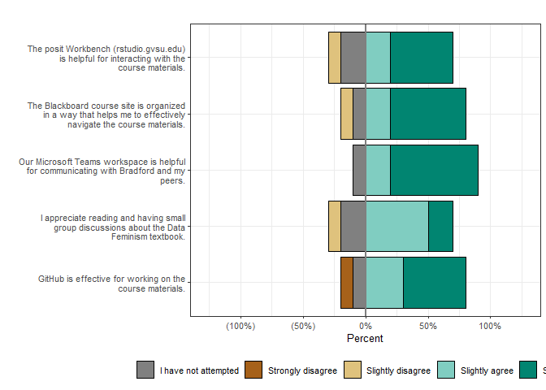
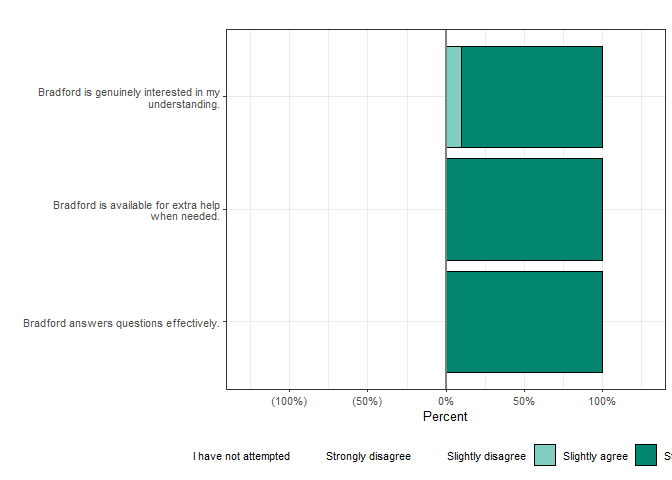
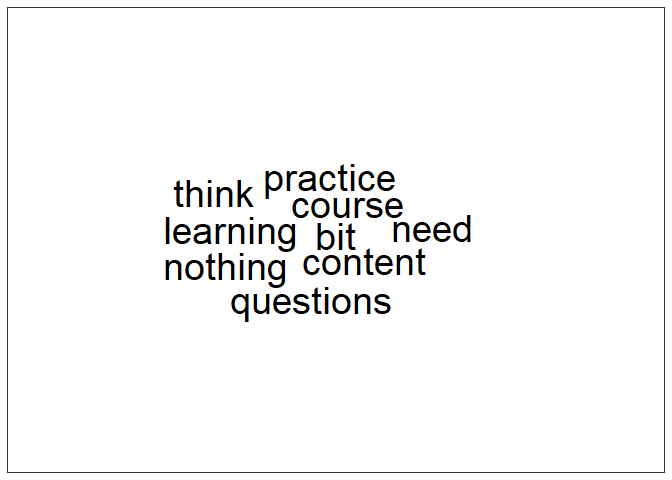
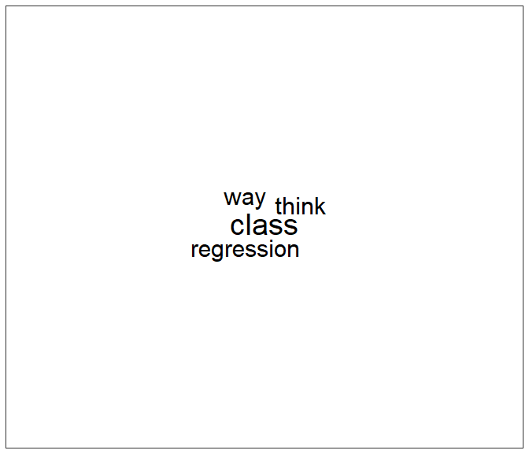

Early Course Evaluation - STA 631
================

## Preparing R

``` r
library(tidyverse)
library(tidytext)
library(ggwordcloud)
```

``` r
# You wont be able to run this as you do not have access on my GDrive
# However, the string here is from the Google Sheet's url - between the "/d/" and "/edit..."
sta631_evals <- googlesheets4::read_sheet("https://docs.google.com/spreadsheets/d/1_hvgvVPWbjrVDrOPPlb1U6ZDDxyw2iVUrS5FHxmGrOY/edit#gid=1940158762")

# Create scales and color palettes
effort_scale <- c("I have not attempted", "Less than 50%", "More than 50%, but not everything", "Essentially 100%")
attempt_scale <- c("I have not attempted", "I have attempted")
likert_scale <- c("I have not attempted", "Strongly disagree", "Slightly disagree",
                  "Slightly agree", "Strongly agree")

likert_palette <- c("#808080", RColorBrewer::brewer.pal(length(likert_scale) - 1, "BrBG"))
effort_palette <- likert_palette[c(1,2,4,5)]
attempt_palette <- likert_palette[c(1,5)]


effort_info <- tibble(
  scale = factor(effort_scale, levels = effort_scale),
  color = effort_palette
)
attempt_info <- tibble(
  scale = factor(attempt_scale, levels = attempt_scale),
  color = attempt_palette
)
likert_info <- tibble(
  scale = factor(likert_scale, levels = likert_scale),
  color = likert_palette
)
```

This report was generated with **15 responses**.

## Your Engagement

``` r
# Rel freq table by effort response
effort_summary <- sta631_evals %>% 
  select(starts_with("I have completed")) %>% 
  mutate(across(everything(), ~factor(., level = effort_scale))) %>% 
  pivot_longer(
    everything(), 
    names_to = "item", 
    values_to = "response",
    names_pattern = ".* \\[(.*)\\]") %>% 
  group_by(item, response) %>% 
  summarise(freq = n()) %>% 
  mutate(perc = freq / sum(freq) * 100)

# Add color column
effort <- effort_summary %>% 
  left_join(effort_info, by = c("response" = "scale"))

# PLOT!!!!
effort %>% 
  ggplot() +
  geom_bar(aes(y = str_wrap(item, width = 40), x = perc, fill = color),
           position = "stack", stat = "identity") +
  labs(y = "",
       x = "Percent") +
  scale_x_continuous(limits = c(0, 100)) +
  scale_fill_identity("", 
                    labels = effort_scale, 
                    guide = "legend",
                    breaks = effort_palette) +
  theme_bw() +
  theme(legend.position="bottom",
        legend.box="horizontal",
        legend.text = element_text(size = 8))
```

<!-- -->

``` r
# Rel freq table by effort response
help_summary <- sta631_evals %>% 
  select(starts_with("I have sought")) %>% 
  mutate(across(everything(), ~factor(., level = attempt_scale))) %>% 
  pivot_longer(
    everything(), 
    names_to = "item", 
    values_to = "response",
    names_pattern = ".* \\[(.*)\\]") %>% 
  group_by(item, response) %>% 
  summarise(freq = n()) %>% 
  mutate(perc = freq / sum(freq) * 100)

# Add color column
help <- help_summary %>% 
  left_join(attempt_info, by = c("response" = "scale"))

# PLOT!!!!
help %>% 
  ggplot() +
  geom_bar(aes(y = str_wrap(item, width = 40), x = perc, fill = color),
           position = "stack", stat = "identity") +
  labs(y = "",
       x = "Percent") +
  scale_x_continuous(limits = c(0, 100)) +
  scale_fill_identity("", 
                    labels = attempt_scale, 
                    guide = "legend",
                    breaks = attempt_palette) +
  theme_bw() +
  theme(legend.position="bottom",
        legend.box="horizontal",
        legend.text = element_text(size = 8))
```

<!-- -->

## General STA 631 Items

``` r
course_summary <- sta631_evals %>% 
  select(contains("Learning Objectives")) %>% 
  mutate(across(everything(), ~factor(., level = likert_scale))) %>% 
  pivot_longer(everything(), names_to = "item", values_to = "response",
               names_pattern = ".* \\[(.*)\\]") %>% 
  group_by(item, response) %>% 
  summarise(freq = n()) %>% 
  mutate(perc = round(freq / sum(freq) * 100, 1))

course <- course_summary %>% 
  select(-freq) %>% 
  left_join(likert_info, by = c("response" = "scale"))

course_agree <- course %>% 
  filter(str_detect(response, " agree"))

course_disagree <- course %>% 
  filter(!str_detect(response, " agree"))

ggplot() +
  # Notice that I am plotting two different datasets, the "agree" dataset:
  geom_bar(data = course_agree,
           aes(y = str_wrap(item, width = 40), x = perc, fill = color),
           position = "stack", stat = "identity") +
  # And the "disagree" dataset:
  geom_bar(data = course_disagree,
           aes(y = str_wrap(item, width = 40), x = -perc, fill = color),
           position = "stack", stat = "identity") +
  labs(y = "",
       x = "Percent") +
  scale_x_continuous(limits = c(-100, 100)) +
  scale_fill_identity("", labels = likert_scale, 
                      breaks = likert_palette, guide = "legend",
                      drop = FALSE) +
  theme_bw() +
  theme(legend.position="bottom",
        legend.box="horizontal",
        legend.text = element_text(size = 8))
```

<!-- -->

``` r
tools_summary <- sta631_evals %>% 
  select(contains("STA 631 course tools")) %>% 
  mutate(across(everything(), ~factor(., level = likert_scale))) %>% 
  pivot_longer(everything(), names_to = "item", values_to = "response",
               names_pattern = ".* \\[(.*)\\]") %>% 
  group_by(item, response) %>% 
  summarise(freq = n()) %>% 
  mutate(perc = round(freq / sum(freq) * 100, 1))

tools <- tools_summary %>% 
  select(-freq) %>% 
  left_join(likert_info, by = c("response" = "scale"))

tools_agree <- tools %>% 
  filter(str_detect(response, " agree"))

tools_disagree <- tools %>% 
  filter(!str_detect(response, " agree"))

ggplot() +
  # Notice that I am plotting two different datasets, the "agree" dataset:
  geom_bar(data = tools_agree,
           aes(y = str_wrap(item, width = 40), x = perc, fill = color),
           position = "stack", stat = "identity") +
  # And the "disagree" dataset:
  geom_bar(data = tools_disagree,
           aes(y = str_wrap(item, width = 40), x = -perc, fill = color),
           position = "stack", stat = "identity") +
  labs(y = "",
       x = "Percent") +
  scale_x_continuous(limits = c(-100, 100)) +
  scale_fill_identity("", labels = likert_scale, 
                      breaks = likert_palette, guide = "legend",
                      drop = FALSE) +
  theme_bw() +
  theme(legend.position="bottom",
        legend.box="horizontal",
        legend.text = element_text(size = 8))
```

<!-- -->

``` r
instructor_summary <- sta631_evals %>% 
  select(contains("Instructor")) %>% 
  mutate(across(everything(), ~factor(., level = likert_scale))) %>% 
  pivot_longer(everything(), names_to = "item", values_to = "response",
               names_pattern = ".* \\[(.*)\\]") %>% 
  group_by(item, response) %>% 
  summarise(freq = n()) %>% 
  mutate(perc = round(freq / sum(freq) * 100, 1))

instructor <- instructor_summary %>% 
  select(-freq) %>% 
  left_join(likert_info, by = c("response" = "scale"))

instructor_agree <- instructor %>% 
  filter(str_detect(response, " agree"))

instructor_disagree <- instructor %>% 
  filter(!str_detect(response, " agree"))

ggplot() +
  # Notice that I am plotting two different datasets, the "agree" dataset:
  geom_bar(data = instructor_agree,
           aes(y = str_wrap(item, width = 40), x = perc, fill = color),
           position = "stack", stat = "identity") +
  # And the "disagree" dataset:
  geom_bar(data = instructor_disagree,
           aes(y = str_wrap(item, width = 40), x = -perc, fill = color),
           position = "stack", stat = "identity") +
  labs(y = "",
       x = "Percent") +
  scale_x_continuous(limits = c(-100, 100)) +
  scale_fill_identity("", labels = likert_scale, 
                      breaks = likert_palette, guide = "legend",
                      drop = FALSE) +
  theme_bw() +
  theme(legend.position="bottom",
        legend.box="horizontal",
        legend.text = element_text(size = 8))
```

<!-- -->

## Free response

### What has been the best aspect of this course so far?

``` r
best <- sta631_evals %>% 
  select(best = starts_with("What as")) %>% 
  mutate(individual = row_number()) %>% 
  unnest_tokens(bigram, best, token = "ngrams", n = 2)

best_sing <- sta631_evals %>% 
  select(starts_with("What as")) %>% 
  rename(best = starts_with("What as")) %>% 
  mutate(individual = row_number()) %>% 
  unnest_tokens(bigram, best) %>% 
  anti_join(get_stopwords(), by = c("bigram" = "word"))

best_sep <- best %>%
  separate(bigram, c("word1","word2"), sep = " ")

best_filtered <-  best_sep %>% 
  filter(!word1 %in% stop_words$word) %>% 
  filter(!word2 %in% stop_words$word)

best_cleaned <- best_filtered %>% 
  unite(bigram, word1, word2, sep = " ")

best_cleaned <- bind_rows(best_sing, best_cleaned)
```

``` r
best_cleaned %>%
  count(bigram, sort = TRUE) %>%
  filter(n > 1) %>% 
  ggplot(aes(label = bigram, size = n)) + 
  geom_text_wordcloud() +
  scale_size_area(max_size = 10) +
  theme_bw()
```

<!-- -->

### If there was one thing about this course that you would change?

``` r
change <- sta631_evals %>% 
  select(change = starts_with("If there")) %>% 
  mutate(individual = row_number()) %>% 
  unnest_tokens(bigram, change, token = "ngrams", n = 2)

change_sing <- sta631_evals %>%
  select(starts_with("If there")) %>% 
  rename(change = starts_with("If there")) %>% 
  mutate(individual = row_number()) %>% 
  unnest_tokens(bigram, change) %>% 
  anti_join(get_stopwords(), by = c("bigram" = "word"))

change_sep <- change %>%
  separate(bigram, c("word1","word2"), sep = " ")

change_filtered <-  change_sep %>% 
  filter(!word1 %in% stop_words$word) %>% 
  filter(!word2 %in% stop_words$word)

change_cleaned <- change_filtered %>% 
  unite(bigram, word1, word2, sep = " ")

change_cleaned <- bind_rows(change_sing, change_cleaned)
```

``` r
change_cleaned %>%
  count(bigram, sort = TRUE) %>%
  filter(n > 1) %>% 
  ggplot(aes(label = bigram, size = n)) + 
  geom_text_wordcloud() +
  scale_size_area(max_size = 10) +
  theme_bw()
```

<!-- -->

### What is one thing that you can do differently to improve your learning?

``` r
improve <- sta631_evals %>% 
  select(differently = starts_with("What is")) %>% 
  mutate(individual = row_number()) %>% 
  unnest_tokens(bigram, differently, token = "ngrams", n = 2)

improve_sing <- sta631_evals %>% 
  select(differently = starts_with("What is")) %>% 
  mutate(individual = row_number()) %>% 
  unnest_tokens(bigram, differently) %>% 
  anti_join(get_stopwords(), by = c("bigram" = "word"))

improve_sep <- improve %>%
  separate(bigram, c("word1","word2"), sep = " ")

improve_filtered <-  improve_sep %>% 
  filter(!word1 %in% stop_words$word) %>% 
  filter(!word2 %in% stop_words$word)

improve_cleaned <- improve_filtered %>% 
  unite(bigram, word1, word2, sep = " ")

improve_cleaned <- bind_rows(improve_sing, improve_cleaned)
```

``` r
improve_cleaned %>%
  count(bigram, sort = TRUE) %>%
  filter(n > 1) %>% 
  ggplot(aes(label = bigram, size = n)) + 
  geom_text_wordcloud() +
  scale_size_area(max_size = 10) +
  theme_bw()
```

<!-- -->
